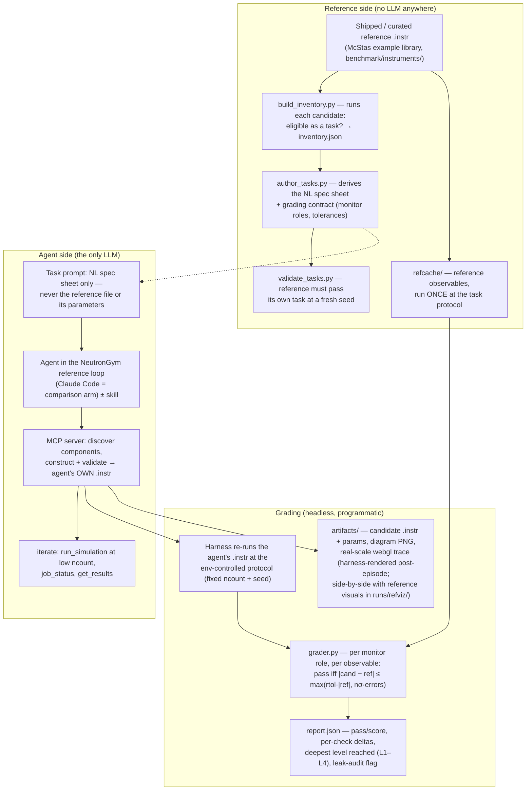

# NeutronGym

**An executable, physically-verifiable RL environment for neutron instrument
design with LLM agents.** Agents design real neutron instruments — SANS
machines, spectrometers, diffractometers — against [McStas](https://www.mcstas.org/)
Monte-Carlo ray-tracing as the simulation backend. Every reward is computed
from physics observables (flux, beam statistics, resolution); there is no LLM
judge anywhere in the loop.

**McStasBench** is NeutronGym's held-out benchmark slice: curated
paper↔instrument reproduction tasks (T1), calibrated improve-to-target-spec
tasks (T2), and open-design briefs (T3), with contamination controls
(memorization probes, held-out 2024–26 instruments) and a red-teamed reward.

## What's inside

| Piece | Where | What |
|---|---|---|
| `mcstas-mcp` server | `src/mcstas_mcp/` | 22 MCP tools: component introspection, validated instrument construction, async simulation, scans, classical optimization |
| Design skill | `skills/mcstas-instrument-design/` | the physics judgment layer: workflow, units, figures of merit, archetypes, verification checklist |
| Benchmark + env harness | `benchmark/` | tasks, observable-based grader, memorization probe, episode runner, classical-baseline calibration |
| Dashboards | `progress.html`, `guide.html`, `benchmark/tasks.html` | generated, never hand-edited: progress, how-the-agent-works, task catalog |

## How it works

Two independent realizations of the same instrument meet in the grader —
the reference side never involves an LLM; the agent side is the only place
a model runs:



T2 (improve) tasks take a different path through the same grader: the agent
*is given* a baseline instrument plus quantitative targets, and
`grade_improvement` checks its figure-of-merit against a pre-calibrated,
fresh-seed-verified classical best with constraint bands — no reference
comparison. In both paths, every number comes from the simulation; there is
no LLM judge.

### Simulation budget ladder (ncount per stage)

Different stages deliberately run at different Monte-Carlo budgets — cheap
where speed matters, expensive only where a claim rests on it:

| Stage | ncount | Role |
|---|---|---|
| Fast-tier RL rollouts | 1e5 | ~0.04 s/rollout via direct binary execution — dense training signal |
| Curation sweep (`build_inventory.py`) | 1e5 | cheap eligibility check across candidate references |
| Agent iteration inside an episode | agent's choice, typically 1e5–1e6 (cap 1e8) | design-loop feedback, never graded |
| **Grading protocol (every task, both sides)** | **1e6, fixed seed** | reference and candidate measured identically; ~0.1% relative error on well-lit monitors |
| Final validation of headline claims | ≥1e8, fresh seed | production bar — e.g. T2 improvements must survive fresh-seed re-verification |

The grader stays honest at 1e6 because its tolerances are statistics-aware —
`max(rtol·|ref|, nσ·errors)` absorbs Monte-Carlo noise — and any monitor
below 1,000 events hard-fails as ungradable rather than being compared.
Weak-signal monitor roles on the largest spectrometers (IN5, LET) get
per-task higher-stat protocols instead of a global ncount bump (planned,
"grow T1" work).

## Repository map

Three layers: docs/plan at the root, product code (`src/`, `skills/`),
research artifacts (`benchmark/`, `runs/`, `note/`).

| Path | What it holds |
|---|---|
| `SCOPE.md` | goal & scope anchor: the claims (with wording rules), in/out-of-scope boundaries, non-negotiables |
| `PLAN.md` | living milestone plan M0–M8 with acceptance criteria and de-risk gates; check items off here |
| `CLAUDE.md` | working conventions + the sources-of-truth ordering for agent sessions |
| `note/` | the project's memory: dated decision notes (feasibility spec, scope decisions, M1 server design) and systematic studies (McStas toolchain, McStasScript API, instrument-paper pairs). Highest authority — a standing decision changes only with a dated note here |
| `src/neutrongym/` | the environment package (M5 build target): reward-ladder API, env executor, procedural generator, and the reference loop (`agent.py` — the model-agnostic scaffold behind all headline numbers) |
| `src/mcstas_mcp/` | server code only, no data: `catalog.py` (component introspection), `registry.py` (validated construction), `execution.py` (async jobs), `results.py`, `optimization.py`, `server.py` (FastMCP entry). Runtime state lives outside the repo in `~/.mcstas-mcp/` (per-project instrument specs, built `.instr` files, `jobs.json`) |
| `skills/mcstas-instrument-design/` | `SKILL.md` rules distilled from real agent transcripts (+ `references/`, `scripts/`); the committed `.claude/skills/` symlink loads it into local sessions |
| `benchmark/` | code and data separated — see `benchmark/README.md`. `harness/` (all code: grader, episode runner, task authoring/validation, calibration, probes); data: `tasks/` (task JSONs by tier — P pilots, T1 reproduce, T2 improve, T3 open design), `refcache/` (gitignored cached reference-run summaries — the grading ground truth), `instruments/` (committed T2 baselines), `inventory.json` (the paper↔`.instr` candidate pool), `tasks.html` |
| `runs/` | all simulation and episode output — gitignored, regenerable: `pilot/` agent episodes (`transcript.jsonl`, `report.json`, isolated `home/`+`cwd/` per episode), calibration/validation runs, `_view/` viewer builds |
| `scripts/` | human-facing utilities: dashboard generators (`progress_report.py`, `guide_report.py`, `tasks_report.py`), `view_instrument.py` (3D/diagram viewer), smoke tests and milestone walkthroughs |
| `tests/` | regression suite per layer, incl. adversarial-review regressions, `%Example:` ground-truth checks, and skill-rule tests |
| `.mcp.json` · `pyproject.toml` · `.claude/` | MCP server registration · packaging (editable install) · local Claude Code config |

Data flow in one line: task JSONs + `refcache/` references → `run_episode.py`
drives an agent through the MCP server + skill → transcripts and graded
reports land in `runs/` → recurring agent mistakes become `SKILL.md` rules,
decisions become `note/` entries → `PLAN.md`.

Where instruments end up: agent-built instruments live inside each episode's
isolated `runs/.../home/instruments/`; interactive sessions write to
`~/.mcstas-mcp/projects/`.

## Quick start (this machine's setup)

```bash
conda create -n mcstas -c conda-forge mcstas-core mcstas-data ncrystal python=3.11
conda run -n mcstas pip install -e ".[dev]"
conda run -n mcstas python -m pytest tests -q          # ~100 tests
conda run -n mcstas python scripts/m1_walkthrough.py   # server demo, end to end
conda run -n mcstas python benchmark/harness/run_episode.py benchmark/tasks/T1/T1_PSI_DMC.json
```

The last command runs a real headless agent episode: an LLM rebuilds a
validated model of PSI's DMC powder diffractometer from a natural-language
spec and is graded against the hidden reference on simulation observables.

## Status

Infrastructure and benchmark harness complete and self-validated; environment
build (executor, procedural generation, reward-ladder API) in progress.
See `progress.html` for the live plan and `PLAN.md` for the source of truth.
Target: ICLR 2027.
