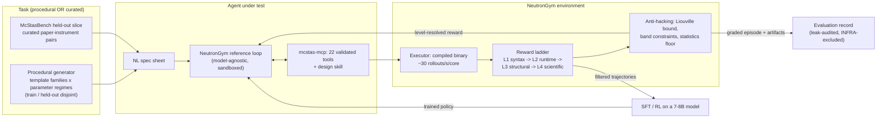

# NeutronGym — paper outline + Figure 1 (draft 2026-09-12)

*ICLR 2027 · abstract Sep 18 · full paper Sep 25 AoE. Figure-1-first
discipline: the paper should be understandable from Figure 1 alone.*
**Every claim below is tagged with the evidence that supports it and, where
the evidence does not support a stronger version, the weaker version is
what appears.** Source of numbers: `benchmark/RESULTS.md` (regenerable).

---

## Figure 1 — the loop (draw before writing prose)

**Caption draft.** NeutronGym turns neutron instrument design into an
executable environment: tasks are either procedurally generated (unlimited,
with held-out parameter regimes) or drawn from McStasBench, the curated
held-out slice. An agent works only through validated MCP tools inside a
sandbox; every artifact it builds is executed by McStas and scored by a
level-resolved reward ladder with physics-native anti-hacking checks. The
same reward that grades evaluation episodes supplies the training signal,
so evaluation and training share one instrument.

---

## Section skeleton, with the evidence that fills it

### 1. Introduction
- Claim wording, fixed: **"the first executable environment for *neutron
  instrument design*"** — never the unqualified "first executable
  scientific environment" (MDGYM et al.). **Prior-art re-check is
  MANDATORY before submission** (last done 2026-07-09 — stale).
- Contribution list: environment · benchmark slice · reference loop ·
  red-teamed reward · cross-model evaluation · trainability result
  (whatever M8 yields, reported honestly).

### 2. The environment
- Fast tier: compiled-binary execution, ~30 rollouts/s/core, compile-once
  per family (`RESULTS.md`, `runs/env_acceptance/acceptance.json`).
- Reward ladder L1–L4 + deepest-level-reached as a first-class field.
- Procedural generation with **disjoint held-out regimes**.
- Acceptance: 104 instances end-to-end, level-resolved records.

### 3. McStasBench (the held-out slice)
- 19 T1 / 2 T2 / 2 T3 + pilots; auto-authored from machine-verified
  references; every task self-validates at a fresh seed.
- **Contamination architecture**: per-model memorization probes
  (`benchmark/contamination/`), 2 never-public held-out instruments,
  3 perturbed variants each with a committed pair-proof.
- **Sandbox**: three layers, and the honest origin story — a 2026-07-30
  audit found 4/7 pilot episodes had fetched the reference through
  legitimate tools. **Zero leaks in 271 scored episodes since.**

### 4. Reward red-teaming (paper section, six findings)
Beamstop leakage → band constraints · optimizer bounds escape → filtered
ensembles · winner's curse → fresh-seed re-verification · monitor-matching
decoy → position-aware matching · and the Liouville gate's own statistical
false positive → floor-gating. Source: `note/reward-red-team-2026-08-05.md`.

### 5. Evaluation results
- Cross-model matrix, 271 valid episodes, $122, zero leaks.
- **Statistical honesty section, non-negotiable**: arm-vs-arm differences
  on the seen tier are NOT resolvable at n=17 (all p ≥ 0.70). The held-out
  loop advantage (paired 7/8 vs 2/8, p=0.041) is reported *with* its
  confound: held-out instruments are significantly easier than seen ones
  (p=0.0009), an uncontrolled alternative explanation.
- **T2 is unsolved by every model in every arm** — the improvement tier's
  headroom, and the motivation for the RL track.
- Failure taxonomy: one-shot dies at L1 (won't compile), the loop dies at
  L0 (never completes). 42 format / 118 physics.

### 6. Trainability (M8) — a pre-registered negative result, with its mechanism

- **Setup:** self-generated RAFT on the leak-free guide family at a bar of
  1.0× the calibrated classical optimum. The untrained Qwen3-8B's strict-L4
  successes (135/300 train instances, 422 per-turn pairs, prompts
  token-identical to serving) → LoRA r=32 on all seven projections, 2 epochs
  → merged checkpoint served with the base model's exact vLLM flags.
- **Result (n=300 paired held-out instances):** untrained 8B 40.3%, trained
  8B **31.3%**, untrained 32B 54.7%. Trained vs untrained: McNemar 20 vs 47,
  **p=0.0013**; level migration **downward**, Cochran–Armitage p=0.003. The
  pre-registered claim bar (≥10 pts gain) is not met; the effect is a
  significant regression. The 32B's lead over the 8B is real (38 vs 81,
  p=0.0001), so the ladder had a target and training moved away from it.
- **Mechanism — it cloned the search, not the solution.** Per-turn SFT gives
  every assistant turn equal weight, and exploration turns outnumber the one
  decisive turn in each episode. 46% of training episodes open at the
  all-max corner and many keep w_in pinned at its maximum while sweeping
  w_out; the passing move is usually lowering w_in (modal passing action
  w_in=0.05, 39/135). The trained model opens at the corner on 20/20
  held-out prompts (untrained 12/20) and runs a fixed w_in-pinned sweep
  (26/30 replays; one exact 6-step trajectory recurs 5/30), ignoring the
  instance-specific feedback. No single training trajectory was copied
  verbatim (83/135 distinct).
- **Methods lessons** (stand regardless of any follow-up): uncalibrated
  ladders manufacture ceilings (cite RLVE); small-n gates reverse (the
  8B–32B comparison read tie → +22 → +7 → +14 across n=10/25/100/300);
  a reward hole can make most successes fake (SANS, below and §4); and
  multi-turn rejection sampling over-weights exploration turns.

### 7. Limitations (write this honestly, it is short and load-bearing)
- n=17 curated tasks cannot resolve scaffold differences.
- 2 held-out instruments, both simpler than the seen median.
- Single substrate (McStas), single domain.
- Serving-level variance is a real confound (Vertex withdrew a model
  mid-campaign; the same model tool-called differently elsewhere).
- **Three of this project's own claims were retracted after review** —
  infra-as-capability, a scaffold-superiority claim that died on
  statistics, and a "tool-surface" claim that was our own harness. Say so.
- Temperature-0 serving is not bit-deterministic under vLLM batching: the same 0.8× sweep cell read +16 then +14 points on two runs. Report intervals, not point estimates.
- The 8B/32B equivalence is measured at temperature 0, one episode per
  instance, so a per-instance disagreement cannot be decomposed into
  capability versus luck without resampling.

### 8. Release
pip-installable `neutrongym`; `neutrongym-eval` one-command slice;
committed per-episode evidence (1081 files) so every number is auditable.

---

## Claim inventory — what the data can and cannot carry

| Claim | Status |
|---|---|
| Zero reference leaks across 271 scored episodes | **solid** |
| T2 unsolved by every model in every arm | **solid** |
| Untrained open-weights floor; 32B ⊃ 8B pass set | **solid** (ordering; rate p=0.60) |
| Failure-mode structure (one-shot L1 vs loop L0) | **solid as distribution** |
| Fast tier ~30 rollouts/s/core; acceptance passed | **solid** |
| Loop > one-shot on held-out | **suggestive, confounded** — 10/14 vs 2/14 over 7 models (p=0.006), always stated with the held-out-is-easier confound (10/14 vs 20/113, p=0.0001) |
| One-shot > loop on seen tier | **RETRACTED** (all p ≥ 0.70) |
| Tool-surface size defeats weak models | **RETRACTED** (was our harness) |
| Trainability delta (RAFT SFT on guide) | **NEGATIVE, significant** — 40.3% → 31.3% at n=300 paired (McNemar p=0.0013; downward level migration p=0.003). Pre-registered claim bar not met. Mechanism: per-turn SFT cloned exploration turns (w_in-pinned sweep) over the decisive move |
| 32B > 8B on calibrated procedural instances (guide) | **supported at n=300** — 54.7% vs 40.3%, McNemar 81v38, p=0.0001. Earlier reads (n=10 tie, n=25 +22 inflated by SANS leakage, n=100 +7 p=0.35) were small-sample or leak-contaminated |
| Uncalibrated reward ladders manufacture ceilings | **solid** (80%/93% → 70%/70% after per-instance calibration) |
| Dense per-step FOM feedback makes the task non-discriminating | **RETRACTED** — the task discriminates at n=25; the idea came from an underpowered read |
