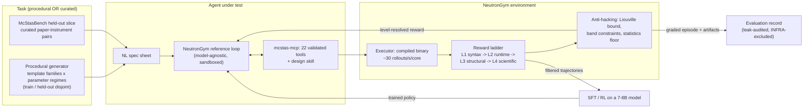

# NeutronGym — paper outline + Figure 1 (draft 2026-09-12)

*ICLR 2027 · abstract Sep 18 · full paper Sep 25 AoE. Figure-1-first
discipline: the paper should be understandable from Figure 1 alone.*
**Every claim below is tagged with the evidence that supports it and, where
the evidence does not support a stronger version, the weaker version is
what appears.** Source of numbers: `benchmark/RESULTS.md` (regenerable).

---

## Figure 1 — the loop (draw before writing prose)

**Caption draft.** NeutronGym turns neutron instrument design into an
executable environment: tasks are either procedurally generated (unlimited,
with held-out parameter regimes) or drawn from McStasBench, the curated
held-out slice. An agent works only through validated MCP tools inside a
sandbox; every artifact it builds is executed by McStas and scored by a
level-resolved reward ladder with physics-native anti-hacking checks. The
same reward that grades evaluation episodes supplies the training signal,
so evaluation and training share one instrument.

---

## Section skeleton, with the evidence that fills it

### 1. Introduction
- Claim wording, fixed: **"the first executable environment for *neutron
  instrument design*"** — never the unqualified "first executable
  scientific environment" (MDGYM et al.). **Prior-art re-check is
  MANDATORY before submission** (last done 2026-07-09 — stale).
- Contribution list: environment · benchmark slice · reference loop ·
  red-teamed reward · cross-model evaluation · trainability result
  (whatever M8 yields, reported honestly).

### 2. The environment
- Fast tier: compiled-binary execution, ~30 rollouts/s/core, compile-once
  per family (`RESULTS.md`, `runs/env_acceptance/acceptance.json`).
- Reward ladder L1–L4 + deepest-level-reached as a first-class field.
- Procedural generation with **disjoint held-out regimes**.
- Acceptance: 104 instances end-to-end, level-resolved records.

### 3. McStasBench (the held-out slice)
- 19 T1 / 2 T2 / 2 T3 + pilots; auto-authored from machine-verified
  references; every task self-validates at a fresh seed.
- **Contamination architecture**: per-model memorization probes
  (`benchmark/contamination/`), 2 never-public held-out instruments,
  3 perturbed variants each with a committed pair-proof.
- **Sandbox**: three layers, and the honest origin story — a 2026-07-30
  audit found 4/7 pilot episodes had fetched the reference through
  legitimate tools. **Zero leaks in 271 scored episodes since.**

### 4. Reward red-teaming (paper section, five findings)
Beamstop leakage → band constraints · optimizer bounds escape → filtered
ensembles · winner's curse → fresh-seed re-verification · monitor-matching
decoy → position-aware matching · and the Liouville gate's own statistical
false positive → floor-gating. Source: `note/reward-red-team-2026-08-05.md`.

### 5. Evaluation results
- Cross-model matrix, 271 valid episodes, $122, zero leaks.
- **Statistical honesty section, non-negotiable**: arm-vs-arm differences
  on the seen tier are NOT resolvable at n=17 (all p ≥ 0.70). The held-out
  loop advantage (paired 7/8 vs 2/8, p=0.041) is reported *with* its
  confound: held-out instruments are significantly easier than seen ones
  (p=0.0009), an uncontrolled alternative explanation.
- **T2 is unsolved by every model in every arm** — the improvement tier's
  headroom, and the motivation for the RL track.
- Failure taxonomy: one-shot dies at L1 (won't compile), the loop dies at
  L0 (never completes). 42 format / 118 physics.

### 6. Trainability (M8 — running; numbers frozen Sep 17)

- **~~The claim bar has a target.~~ Superseded by the n=100 guide probe — see the claim inventory; the 32B is context only.** On held-out procedural instances with
  calibrated targets (n=25 per family per model), the untrained Qwen3-32B
  leads the untrained Qwen3-8B by **+14 to +16 points at 0.8× the classical
  optimum and +22 at 1.0×**; at 1.2× the 8B is at the floor. Training bar:
  **1.0×** (both mid-range, largest gap: 8B 0.36 → 32B 0.58).
- **Design (plan rev 2):** self-generated RAFT — sample the untrained 8B on
  TRAIN-split instances (context regimes disjoint from held-out), keep strict
  L4 passes, LoRA SFT on its own successes (r=32, all seven projections,
  loss on every assistant turn via per-turn pairs rendered exactly as served,
  template identity checked against the live server). Isolates the reward's
  contribution from distillation.
- **Eval:** trained vs untrained 8B vs untrained 32B, same `evaluate()`
  primitive, same instances and bar, trained model served with the base
  8B's exact vLLM flags. Primary endpoint level migration (Cochran–Armitage);
  pass-rate claim needs ≥10 pts absolute or beating the 32B; paired McNemar;
  fraction of the 8B→32B gap closed; classical optimum as context.
- **Methods lessons that stand regardless of the SFT outcome:**
  (1) *uncalibrated reward ladders manufacture ceilings* — `target_ratio =
  1.0` put the untrained 8B at 80% and 32B at 93%; per-instance calibration
  against a constraint-filtered, fresh-seed-verified classical optimum fixed
  it. (2) *a small-n gate can reverse* — at n=10 per family the gate read
  0.70 vs 0.70 and a keep-rate check demanded 100%; both would have
  cancelled M8 on an artifact. Report the difficulty-response curve, not a
  single operating point.
- **If no delta:** reported as a null result against a real target, with the
  gate history above.

### 7. Limitations (write this honestly, it is short and load-bearing)
- n=17 curated tasks cannot resolve scaffold differences.
- 2 held-out instruments, both simpler than the seen median.
- Single substrate (McStas), single domain.
- Serving-level variance is a real confound (Vertex withdrew a model
  mid-campaign; the same model tool-called differently elsewhere).
- **Three of this project's own claims were retracted after review** —
  infra-as-capability, a scaffold-superiority claim that died on
  statistics, and a "tool-surface" claim that was our own harness. Say so.
- Temperature-0 serving is not bit-deterministic under vLLM batching: the same 0.8× sweep cell read +16 then +14 points on two runs. Report intervals, not point estimates.
- The 8B/32B equivalence is measured at temperature 0, one episode per
  instance, so a per-instance disagreement cannot be decomposed into
  capability versus luck without resampling.

### 8. Release
pip-installable `neutrongym`; `neutrongym-eval` one-command slice;
committed per-episode evidence (1081 files) so every number is auditable.

---

## Claim inventory — what the data can and cannot carry

| Claim | Status |
|---|---|
| Zero reference leaks across 271 scored episodes | **solid** |
| T2 unsolved by every model in every arm | **solid** |
| Untrained open-weights floor; 32B ⊃ 8B pass set | **solid** (ordering; rate p=0.60) |
| Failure-mode structure (one-shot L1 vs loop L0) | **solid as distribution** |
| Fast tier ~30 rollouts/s/core; acceptance passed | **solid** |
| Loop > one-shot on held-out | **suggestive, confounded** — 10/14 vs 2/14 over 7 models (p=0.006), always stated with the held-out-is-easier confound (10/14 vs 20/113, p=0.0001) |
| One-shot > loop on seen tier | **RETRACTED** (all p ≥ 0.70) |
| Tool-surface size defeats weak models | **RETRACTED** (was our harness) |
| Trainability delta (RAFT SFT on guide) | **pending M8** — claim bar is ≥10 pts over the untrained 8B (the 32B is context, not a target: no clean ordering). Eval n=300 paired for power; SANS excluded |
| 32B > 8B on calibrated procedural instances | **NOT supported.** Guide (clean) at 1.0×, n=100: 0.40 vs 0.47, McNemar 17v24 p=0.35. The combined-sweep significance (p=0.012) came from SANS, where most passes are direct-beam leakage (leak-free 0v3, p=0.25). The n=10 "tie" and the n=25 "+22" were both small-sample reads |
| Uncalibrated reward ladders manufacture ceilings | **solid** (80%/93% → 70%/70% after per-instance calibration) |
| Dense per-step FOM feedback makes the task non-discriminating | **RETRACTED** — the task discriminates at n=25; the idea came from an underpowered read |
