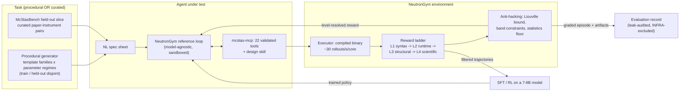

# NeutronGym — paper outline + Figure 1 (draft 2026-09-12)

*ICLR 2027 · abstract Sep 18 · full paper Sep 25 AoE. Figure-1-first
discipline: the paper should be understandable from Figure 1 alone.*
**Every claim below is tagged with the evidence that supports it and, where
the evidence does not support a stronger version, the weaker version is
what appears.** Source of numbers: `benchmark/RESULTS.md` (regenerable).

---

## Figure 1 — the loop (draw before writing prose)

**Caption draft.** NeutronGym turns neutron instrument design into an
executable environment: tasks are either procedurally generated (unlimited,
with held-out parameter regimes) or drawn from McStasBench, the curated
held-out slice. An agent works only through validated MCP tools inside a
sandbox; every artifact it builds is executed by McStas and scored by a
level-resolved reward ladder with physics-native anti-hacking checks. The
same reward that grades evaluation episodes supplies the training signal,
so evaluation and training share one instrument.

---

## Section skeleton, with the evidence that fills it

### 1. Introduction
- Claim wording, fixed: **"the first executable environment for *neutron
  instrument design*"** — never the unqualified "first executable
  scientific environment" (MDGYM et al.). **Prior-art re-check is
  MANDATORY before submission** (last done 2026-07-09 — stale).
- Contribution list: environment · benchmark slice · reference loop ·
  red-teamed reward · cross-model evaluation · trainability result
  (whatever M8 yields, reported honestly).

### 2. The environment
- Fast tier: compiled-binary execution, ~30 rollouts/s/core, compile-once
  per family (`RESULTS.md`, `runs/env_acceptance/acceptance.json`).
- Reward ladder L1–L4 + deepest-level-reached as a first-class field.
- Procedural generation with **disjoint held-out regimes**.
- Acceptance: 104 instances end-to-end, level-resolved records.

### 3. McStasBench (the held-out slice)
- 19 T1 / 2 T2 / 2 T3 + pilots; auto-authored from machine-verified
  references; every task self-validates at a fresh seed.
- **Contamination architecture**: per-model memorization probes
  (`benchmark/contamination/`), 2 never-public held-out instruments,
  3 perturbed variants each with a committed pair-proof.
- **Sandbox**: three layers, and the honest origin story — a 2026-07-30
  audit found 4/7 pilot episodes had fetched the reference through
  legitimate tools. **Zero leaks in 271 scored episodes since.**

### 4. Reward red-teaming (paper section, five findings)
Beamstop leakage → band constraints · optimizer bounds escape → filtered
ensembles · winner's curse → fresh-seed re-verification · monitor-matching
decoy → position-aware matching · and the Liouville gate's own statistical
false positive → floor-gating. Source: `note/reward-red-team-2026-08-05.md`.

### 5. Evaluation results
- Cross-model matrix, 271 valid episodes, $122, zero leaks.
- **Statistical honesty section, non-negotiable**: arm-vs-arm differences
  on the seen tier are NOT resolvable at n=17 (all p ≥ 0.70). The held-out
  loop advantage (paired 7/8 vs 2/8, p=0.041) is reported *with* its
  confound: held-out instruments are significantly easier than seen ones
  (p=0.0009), an uncontrolled alternative explanation.
- **T2 is unsolved by every model in every arm** — the improvement tier's
  headroom, and the motivation for the RL track.
- Failure taxonomy: one-shot dies at L1 (won't compile), the loop dies at
  L0 (never completes). 42 format / 118 physics.

### 6. What the environment can and cannot train (M8 — the plan's own
gate stopped it, and the stop is the result)

The planned section was: filtered SFT on procedural env-dialogue, n=200 per
condition, level migration as the primary readout, ladder untrained 8B →
trained 8B → untrained 32B. **A pre-registered phase-0 gate ran first, and
failed.** Report the gate, not the training run.

- **The bar has no target.** "Approaching a larger untrained model"
  presumes the larger model is ahead. On held-out procedural instances at
  the calibrated difficulty, untrained Qwen3-8B and Qwen3-32B both score
  **0.70**. A 4× parameter increase buys nothing.
- **The paired view is the actual finding, and it is stronger than the
  tie.** The two models agree on only 60% of instances; the 8 disagreements
  split **exactly 4–4** (exact McNemar p = 1.0), and per family the
  directions oppose (guide 3–0 to the 8B, SANS 1–4 to the 32B). This is not
  a small gap — it is **no ordering**, so more data would only sharpen an
  estimate of zero. Marginal pass rates alone would have reported "the
  models are equivalent", which is a different and wrong claim.
- **Why: the dense reward makes it search, not reasoning.** Six steps of
  per-step FOM feedback turn parametric optimization into hill-climbing —
  precisely the job this architecture delegates to scipy (CLAUDE.md), and
  the one where classical constraint-filtered random search reaches 2.95×
  and 1.47× on the T2 tasks while no agent in any arm beats either target.
- **Calibration is part of the finding, not a footnote.** The first
  measurement (8B 80% / 32B 93%) was a ceiling artifact: procedural
  instances shipped with `target_ratio = 1.0`, so L4 meant beating a
  deliberately undersized baseline. `calibrate.py` now sets per-instance
  targets at 0.8× a constraint-filtered, Liouville-checked,
  fresh-seed-re-verified classical optimum — the same discipline as T2.
  **An environment whose reward ladder is not calibrated per instance will
  report a trainability signal that is really a ceiling.** That is a
  transferable lesson for anyone building executable science environments.
- **Difficulty-response and feedback-budget sweeps** distinguish "the bar
  was too low" from "the task does not discriminate at any bar", and test
  whether removing the hill-climbing signal (one-shot, no feedback)
  restores a scale effect.
- **Honest framing:** this is a negative result about *the task*, not about
  the environment or the reward. The reward verifies physics correctly; it
  simply does not separate model scale on the parametric axis. The
  construction axis, where M6 does show scale separation (8B 1/17 vs 32B
  3/17, both dominated by L0), is the right training target — and the
  arithmetic says it needs ~3400 episodes for ~200 RAFT keepers, i.e.
  50–280 h. Future work, stated as such.

### 7. Limitations (write this honestly, it is short and load-bearing)
- n=17 curated tasks cannot resolve scaffold differences.
- 2 held-out instruments, both simpler than the seen median.
- Single substrate (McStas), single domain.
- Serving-level variance is a real confound (Vertex withdrew a model
  mid-campaign; the same model tool-called differently elsewhere).
- **Three of this project's own claims were retracted after review** —
  infra-as-capability, a scaffold-superiority claim that died on
  statistics, and a "tool-surface" claim that was our own harness. Say so.
- **The trainability result is a stopped experiment, not a trained model.**
  We report why the axis cannot carry the claim; we do not report an SFT
  delta, null or otherwise.
- The 8B/32B equivalence is measured at temperature 0, one episode per
  instance, so a per-instance disagreement cannot be decomposed into
  capability versus luck without resampling.

### 8. Release
pip-installable `neutrongym`; `neutrongym-eval` one-command slice;
committed per-episode evidence (1081 files) so every number is auditable.

---

## Claim inventory — what the data can and cannot carry

| Claim | Status |
|---|---|
| Zero reference leaks across 271 scored episodes | **solid** |
| T2 unsolved by every model in every arm | **solid** |
| Untrained open-weights floor; 32B ⊃ 8B pass set | **solid** (ordering; rate p=0.60) |
| Failure-mode structure (one-shot L1 vs loop L0) | **solid as distribution** |
| Fast tier ~30 rollouts/s/core; acceptance passed | **solid** |
| Loop > one-shot on held-out | **suggestive, confounded** — always with p=0.041 AND the difficulty p=0.0009 |
| One-shot > loop on seen tier | **RETRACTED** (all p ≥ 0.70) |
| Tool-surface size defeats weak models | **RETRACTED** (was our harness) |
| Trainability delta | **not claimed** — the phase-0 gate found no 8B/32B ordering to train toward |
| 8B ≡ 32B on calibrated procedural instances | **solid** (0.70 vs 0.70; paired 4–4 discordant, McNemar p=1.0) |
| Uncalibrated reward ladders manufacture ceilings | **solid** (80%/93% → 70%/70% after per-instance calibration) |
| Dense per-step FOM feedback makes the task non-discriminating | **argued, not proven** — consistent with the data; the feedback-budget sweep is the direct test |
